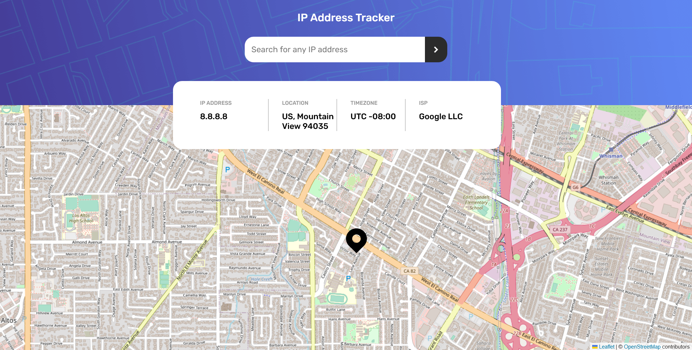

# Frontend Mentor - IP address tracker solution

## Table of contents

- [Overview](#overview)
  - [The challenge](#the-challenge)
  - [Screenshot](#screenshot)
  - [Links](#links)
- [My process](#my-process)
  - [Built with](#built-with)
  - [What I learned](#what-i-learned)
  - [Continued development](#continued-development)
- [Author](#author)

## Overview

### The challenge

Users should be able to:

- View the optimal layout for each page depending on their device's screen size
- See hover states for all interactive elements on the page
- See their own IP address on the map on the initial page load
- Search for any IP addresses and see the key information and location

### Screenshot



### Links

- Solution URL: https://github.com/nidalA1992/ip-address-tracker
- Live Site URL: [Add live site URL here](https://your-live-site-url.com)

## My process

### Built with

- JSX markup
- SCSS modules
- Flexbox
- CSS Grid
- Mobile-first workflow
- Use git branching
- [Feature-Sliced Design](https://feature-sliced.design/) - Architectural methodology for frontend projects
- [TypeScript](https://www.typescriptlang.org/) - Strongly typed JavaScript extension
- [React](https://reactjs.org/) - JS library
- [Leaflet](https://leafletjs.com/) - JavaScript library for interactive maps
- [React Leaflet](https://react-leaflet.js.org/) - React components for Leaflet maps
- [IP Geolocation API](https://geo.ipify.org/) - Real-time IP Geolocation API

### What I learned

CSS trick for center text in some element

```css
::before {
  content: "";
  display: inline-block;
  height: 100%;
  vertical-align: middle;
}
```

## Author

- Frontend Mentor - [@nidalA1992](https://www.frontendmentor.io/profile/ndialA1992)
